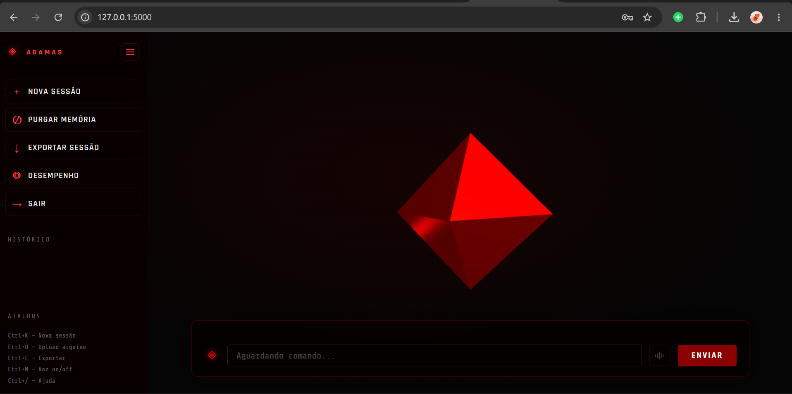

# ◈ ADAMAS — Protocolo de Inteligência

**ADAMAS** é um assistente de estudos técnico com IA, projetado para transformar qualquer documento (PDF, DOCX, TXT ou código-fonte) em uma ferramenta de aprendizado ativo. Diferente de um chatbot comum, o ADAMAS opera em dois modos distintos — **consulta** e **sabatina** — e foi construído com um foco central: **nunca validar uma resposta incorreta por educação**.

Todo o processamento de linguagem natural roda localmente através do [Ollama](https://ollama.com), sem dependência de APIs pagas ou envio de dados para servidores externos.
---

<p align="center">
  
</p>

---

<p align="center">
  
</p>

---

## ✦ Índice

- [Visão Geral](#-visão-geral)
- [Funcionalidades](#-funcionalidades)
- [Arquitetura](#-arquitetura)
- [Stack Tecnológica](#-stack-tecnológica)
- [Instalação](#-instalação)
- [Configuração](#-configuração)
- [Como Usar](#-como-usar)
- [Estrutura do Projeto](#-estrutura-do-projeto)
- [Decisões Técnicas](#-decisões-técnicas)
- [Limitações Conhecidas](#-limitações-conhecidas)
- [Roadmap](#-roadmap)
- [Segurança](#-segurança)
- [Licença](#-licença)

---

## ✦ Visão Geral

O ADAMAS nasceu de um problema simples: assistentes de IA genéricos tendem a ser condescendentes. Quando um estudante responde algo incorreto durante uma revisão, é comum a IA suavizar a correção ou até validar respostas erradas por educação — o que é péssimo para quem está estudando para uma prova.

O ADAMAS resolve isso com uma arquitetura de **classificação em duas etapas isoladas**: primeiro uma chamada ao modelo classifica a resposta como `CORRETO`, `PARCIALMENTE CORRETO` ou `INCORRETO` sem qualquer contexto além da pergunta e resposta; depois, uma segunda chamada gera a explicação com base nessa classificação já definida. O modelo nunca tem liberdade para "amaciar" um erro.

---

## ✦ Funcionalidades

### Modo Consulta
- Responde perguntas e explica conceitos com base **exclusivamente** no conteúdo do documento carregado
- Detecta saudações e responde de forma fixa e objetiva, sem acionar o modelo desnecessariamente
- Nunca apresenta ou resume o conteúdo espontaneamente — só responde o que foi perguntado

### Modo Sabatina
- Ativado por comando natural (`sabatina`, `me teste`, `modo sabatina`, entre outros)
- Perguntas objetivas, uma de cada vez, sobre um único conceito
- Classificação rigorosa em três níveis com verificação em camadas:
  - Camada determinística no backend para respostas de ignorância (`não sei`, `sei lá`) e respostas claramente fora de escopo
  - Camada via modelo de IA para avaliação semântica do conteúdo técnico
- Resumo final com placar real, avaliação honesta e detalhamento de cada pergunta

### Painel de Placar em Tempo Real
- Acompanhamento visual de acertos, parciais e erros durante a sabatina, direto na sidebar

### Dashboard de Desempenho Histórico
- Registro persistente de todas as sessões de sabatina por documento
- Gráfico de evolução do percentual de acertos ao longo do tempo
- Detalhamento expansível de cada pergunta e resposta de sessões anteriores

### Comando de Voz
- Reconhecimento de fala em português brasileiro (Web Speech API)
- Síntese de voz das respostas do ADAMAS
- Compatível com Chrome e Edge

### Autenticação
- Sistema de login e cadastro com senhas criptografadas via `bcrypt`
- Sessões gerenciadas com `Flask-Login`

### Gestão de Documentos
- Upload de PDF, DOCX, TXT e arquivos de código-fonte
- Histórico persistente por documento — a conversa retoma de onde parou
- Troca de documento sem perder o contexto da conversa anterior
- Exclusão individual de documentos

### Exportação
- Exportação da sessão de chat atual em arquivo `.txt`

---

## ✦ Arquitetura

### Fluxo de Classificação da Sabatina

```
Usuário responde
       │
       ▼
┌──────────────────────────┐
│ Camada 1 — Backend        │  → verifica respostas de ignorância
│ (sem chamar o modelo)     │  → verifica termos fora de escopo
└──────────────────────────┘
       │ (se não filtrado)
       ▼
┌──────────────────────────┐
│ Camada 2 — Classificador  │  → retorna APENAS: CORRETO /
│ isolado via IA            │     PARCIALMENTE CORRETO / INCORRETO
└──────────────────────────┘
       │
       ▼
┌──────────────────────────┐
│ Geração da Explicação     │  → recebe a classificação já definida,
│ via IA                    │     não pode alterá-la
└──────────────────────────┘
       │
       ▼
┌──────────────────────────┐
│ Geração da Próxima        │  → nova pergunta, evita repetições
│ Pergunta via IA           │
└──────────────────────────┘
       │
       ▼
Backend monta a resposta final
(prefixo + explicação + próxima pergunta)
```

Essa separação é o que garante que o modelo **nunca decide o próprio veredito livremente** — ele recebe a classificação já pronta e só explica o porquê.

### Modelo de Dados

```
Usuario ─────┐
             │ (autenticação)
             │
Documento ───┼──── Mensagem (histórico de chat, com pergunta_pura)
             │
             └──── SessaoSabatina (histórico de desempenho)
```

---

## ✦ Stack Tecnológica

| Camada           | Tecnologia                  |
|-------------------|------------------------------|
| Backend           | Python + Flask               |
| IA Local          | Ollama + Mistral 7B          |
| Banco de Dados    | SQLite + SQLAlchemy          |
| Autenticação      | Flask-Login + bcrypt         |
| Frontend          | HTML + CSS + JavaScript      |
| Renderização 3D   | Three.js (WebGL)             |
| Voz               | Web Speech API                |
| Extração de Texto | pypdf, python-docx           |

---

## ✦ Instalação

### Pré-requisitos

- Python 3.10 ou superior
- [Ollama](https://ollama.com/download) instalado e em execução

### 1. Clone o repositório

```bash
git clone https://github.com/seu-usuario/adamas.git
cd adamas
```

### 2. Instale as dependências

```bash
pip install -r requirements.txt
```

### 3. Baixe o modelo de IA

```bash
ollama pull mistral
```

### 4. Configure o ambiente

Copie o arquivo de exemplo e edite com seus valores:

```bash
cp .env.example .env
```

Gere uma chave secreta segura:

```bash
python3 -c "import secrets; print(secrets.token_hex(32))"
```

Cole o resultado no `.env`:

```env
SECRET_KEY=sua_chave_gerada_aqui
```

### 5. Execute o servidor

```bash
python app.py
```

Acesse **http://127.0.0.1:5000** no navegador.

---

## ✦ Configuração

O ADAMAS usa um arquivo `.env` na raiz do projeto para variáveis sensíveis:

| Variável      | Descrição                                          | Obrigatório |
|----------------|-----------------------------------------------------|-------------|
| `SECRET_KEY`   | Chave usada pelo Flask para assinar sessões de login | Sim         |

> **Nunca** commite o arquivo `.env` no controle de versão. O `.gitignore` já está configurado para bloqueá-lo.

---

## ✦ Como Usar

1. **Cadastre-se** ou faça login na tela inicial
2. **Envie um documento** clicando no ícone ◈ ao lado do campo de mensagem
3. **Converse normalmente** — pergunte sobre o conteúdo do arquivo
4. Digite **`sabatina`** a qualquer momento para ser testado sobre o material
5. Responda às perguntas — o ADAMAS classifica cada resposta com rigor
6. Digite **`fim`** ou **`fechar sabatina`** para encerrar e ver o resumo
7. Acesse o botão **Desempenho** na sidebar para ver seu histórico de evolução

### Atalhos de Teclado

| Atalho    | Ação                     |
|-----------|--------------------------|
| `Ctrl+K`  | Nova sessão               |
| `Ctrl+U`  | Upload de arquivo         |
| `Ctrl+E`  | Exportar sessão           |
| `Ctrl+M`  | Ativar/desativar voz      |
| `Ctrl+/`  | Exibir ajuda              |
| `Esc`     | Fechar modal              |

---

## ✦ Estrutura do Projeto

```
adamas/
├── app.py                  # Backend Flask — rotas, lógica de IA, banco de dados
├── requirements.txt        # Dependências Python
├── .env.example             # Modelo de variáveis de ambiente
├── .gitignore
├── static/
│   ├── script.js            # Lógica do frontend, voz, dashboard, chat
│   └── style.css            # Identidade visual do ADAMAS
├── templates/
│   ├── index.html           # Interface principal
│   └── login.html           # Tela de login e cadastro
└── temp_files/              # Pasta temporária de uploads (esvaziada após uso)
```

---

## ✦ Decisões Técnicas

| Decisão                        | Problema Resolvido                                            |
|----------------------------------|------------------------------------------------------------------|
| Classificação em etapa isolada   | Modelos de IA tendem a validar respostas erradas por educação    |
| Detecção de modo no backend      | O modelo por vezes ignorava comandos para trocar de modo         |
| Persistência em SQLite          | Substituiu um arquivo JSON simples, evitando corrupção de dados  |
| Campo `pergunta_pura` separado  | Evita que o resumo da sabatina exiba texto de resposta ao invés da pergunta original |
| Interceptação de saudações       | Evita que o modelo liste todo o conteúdo ao receber um "Olá"     |
| Encerramento restrito da sabatina | Impede que uma resposta longa contendo a palavra "fim" encerre a sessão sem intenção |

---

## ✦ Limitações Conhecidas

- O contexto enviado ao modelo é limitado a 8.000 caracteres — documentos muito extensos podem ter conteúdo truncado
- O reconhecimento de voz depende da Web Speech API, disponível apenas em Chrome e Edge
- O SQLite é adequado para uso individual ou pequena escala; múltiplos usuários simultâneos em produção podem exigir migração para PostgreSQL ou MySQL
- O sistema depende do Ollama rodando localmente — não há suporte nativo a APIs de IA em nuvem nesta versão

---

## ✦ Roadmap

- [ ] RAG (Retrieval-Augmented Generation) para lidar com documentos extensos sem truncamento
- [ ] Exportação do relatório de sabatina em PDF
- [ ] Suporte a múltiplos idiomas de interface
- [ ] Migração opcional para banco de dados PostgreSQL/MySQL
- [ ] Modo de estudo colaborativo (múltiplos usuários no mesmo documento)

---

## ✦ Segurança

- Senhas armazenadas exclusivamente como hash `bcrypt`, nunca em texto plano
- Sessões protegidas por `SECRET_KEY` configurável via variável de ambiente
- Todas as rotas de dados exigem autenticação (`@login_required`)
- Arquivos sensíveis (`.env`, banco de dados) excluídos do controle de versão via `.gitignore`

Se encontrar uma vulnerabilidade de segurança, por favor abra uma *issue* privada ou entre em contato diretamente antes de divulgar publicamente.

---

## ✦ Licença

Este projeto está disponível sob a licença MIT. Sinta-se livre para usar, modificar e distribuir, mantendo os créditos originais.

---

<div align="center">

**◈ ADAMAS**
*Protocolo de Inteligência para Estudos Técnicos*

</div>
